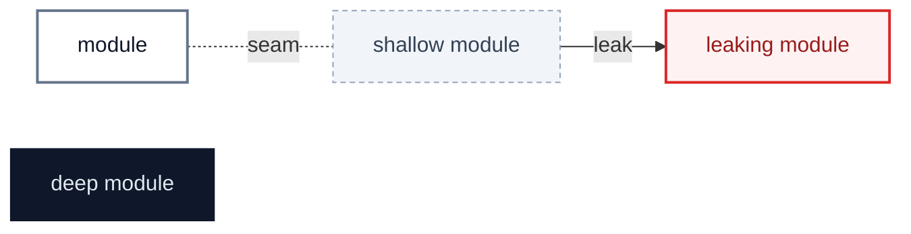
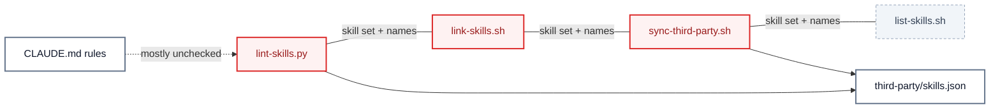

# skills: the repo's tooling re-decides what a skill is in four places

`2026-10-08` · at `44ef104` (`main`) · scope: the shell and Python tooling under `scripts/`, `skills/*/scripts/` and `.github/workflows/`, weighted by `git log --since=3.months` churn (`README.md`, `third-party/skills.json`, `scripts/sync-third-party.sh`, `scripts/lint-skills.py`) · glossary: `GLOSSARY.md` · ADRs read: 0001–0006

**Jump to:** [Status](#status) · [Where it hurts](#where-it-hurts) · [C1](#c1--one-owned-skill-inventory) · [C2](#c2--lint-enforces-the-published-skill-rules) · [C3](#c3--a-manifest-module-for-skillsjson) · [C4](#c4--a-testable-diff-range-filter) · [Smaller findings](#smaller-findings) · [Recommendation](#recommendation)

Legend

## Status

The backlog, in rank order. After the scan only three parts of this file change: this table, each candidate's **Decisions**, and **Departures**. The findings stay as found.

| ID | Deepening | Strength | Lens | Status | Branch | PR | Breaking | Notes |
|---|---|---|---|---|---|---|---|---|
| [C1](#c1--one-owned-skill-inventory) | One owned-skill inventory module | 🟢 Strong · 🔴 live defect | deepening | todo | `refactor/owned-skill-inventory` | | | |
| [C2](#c2--lint-enforces-the-published-skill-rules) | Lint enforces the published-skill rules | 🟢 Strong | maintainability | todo | `refactor/lint-published-rules` | | | builds on C1 |
| [C3](#c3--a-manifest-module-for-skillsjson) | A manifest module for `skills.json` | 🟡 Worth exploring | deepening | todo | `refactor/third-party-manifest` | | | |
| [C4](#c4--a-testable-diff-range-filter) | A testable diff-range filter | ⚪ Speculative | deepening | todo | `refactor/diff-range-filter` | | | |
| [S1](#s1--frontmatter-misreads-a-trailing-comment) | `frontmatter` misreads a trailing comment | — | maintainability | todo | rides with C2 | | | |
| [S2](#s2--sync-third-party-stops-at-the-first-failing-source) | `sync-third-party.sh` stops at the first failing source | — | maintainability | todo | rides with C3 | | | |
| [S3](#s3----check-exits-0-on-most-drift) | `--check` exits 0 on most drift | — | maintainability | todo | rides with C3 | | | |
| [S4](#s4--shell-nits-in-the-review-scripts) | Shell nits in the review scripts | — | maintainability | todo | rides with C4 | | | |

Strength: 🟢 Strong · 🟡 Worth exploring · ⚪ Speculative · 🔴 live defect (a bug reproduced during the scan).
Status: `todo` · `in-progress` · `pr-open` · `merged` · `blocked` · `dropped`. `blocked` and `dropped` always carry a reason in Notes.

## Where it hurts

`README.md` (14 commits), `third-party/skills.json` (8), `scripts/sync-third-party.sh` (8) and `lint-skills.py` (2) are where change keeps landing, and each re-derives facts the others also own.

---

## C1 · One owned-skill inventory

🟢 **Strong** · 🔴 **live defect** · `in-process` · builds on: —

`scripts/lint-skills.py:110` · `scripts/lint-skills.py:135` · `scripts/link-skills.sh:60` · `scripts/sync-third-party.sh:145-155` · `scripts/list-skills.sh`

```mermaid
flowchart LR
  subgraph before["Before"]
    direction TB
    L1["lint-skills.py<br>glob + frontmatter name"]:::leak
    K1["link-skills.sh<br>find + basename, skips deprecated"]:::leak
    T1["sync-third-party.sh<br>find + basename, collision guard"]:::leak
    X1["list-skills.sh<br>find, no callers"]:::shallow
  end
  subgraph after["After"]
    direction TB
    L2["link-skills.sh"]:::module --> I2["Owned skills · list()"]:::deep
    T2["sync-third-party.sh"]:::module --> I2
    C2n["lint-skills.py checks"]:::module --> I2
    subgraph deepmod[" "]
      direction TB
      G2["bucket globbing"]:::faded
      N2["name + duplicate rules"]:::faded
      D2["published vs unpublished"]:::faded
    end
    I2 -.- deepmod
  end
  before ~~~ after
  classDef module fill:#ffffff,stroke:#64748b,stroke-width:2px,color:#0f172a
  classDef shallow fill:#f1f5f9,stroke:#94a3b8,stroke-dasharray:4 3,color:#334155
  classDef deep fill:#0f172a,stroke:#0f172a,color:#e2e8f0
  classDef faded fill:#1e293b,stroke:#475569,color:#94a3b8
  classDef leak fill:#fef2f2,stroke:#dc2626,stroke-width:2px,color:#991b1b
  style deepmod fill:#0f172a,stroke:#0f172a
  style before fill:#fafaf9,stroke:#e2e8f0
  style after fill:#fafaf9,stroke:#e2e8f0
```

> [!CAUTION]
> **Live defect:** a copy of `pr-body` under `skills/misc/` → `lint-skills.py` keeps only the later entry (`skills[name] = {...}`, line 135) and prints `ok`; the real `engineering/pr-body` is never checked against `README.md` or `plugin.json`. No duplicate-name error exists.

| Problem | Solution | Wins |
|---|---|---|
| Four modules decide what an owned skill is, with three exclusion rules (only `link-skills.sh` skips `deprecated/`) and two name sources (frontmatter vs `basename`). | One inventory module owns the buckets, names, and duplicate rule; the shell scripts consume it and `list-skills.sh` is deleted. | locality: one definition of "owned" leverage: three callers, one rule duplicates become an error |

> [!NOTE]
> ADR 0002: the collision guard against curated skills stays; it moves behind the inventory interface instead of living in two scripts.

Decisions

---

## C2 · Lint enforces the published-skill rules

🟢 **Strong** · `in-process` · builds on: C1

`scripts/lint-skills.py:150-157` · `scripts/lint-skills.py:163-166` · `.github/workflows/lint.yml` · `CLAUDE.md`

```mermaid
flowchart LR
  subgraph before["Before"]
    direction TB
    R1["CLAUDE.md rules<br>bucket READMEs, grouping,<br>link format, archived why"]:::module
    L1["lint-skills.py<br>substring match on (./path)"]:::shallow
    R1 -. "unchecked" .-> L1
    B1["bucket README.md ×1"]:::leak
    T1["top-level README grouping"]:::leak
  end
  subgraph after["After"]
    direction TB
    CI2["CI lint"]:::module --> P2["Published-skill rules · check()"]:::deep
    subgraph deepmod[" "]
      direction TB
      A2["README + bucket README links"]:::faded
      G2["User/Model-invoked grouping"]:::faded
      V2["archived why, plugin.json"]:::faded
    end
    P2 -.- deepmod
  end
  before ~~~ after
  classDef module fill:#ffffff,stroke:#64748b,stroke-width:2px,color:#0f172a
  classDef shallow fill:#f1f5f9,stroke:#94a3b8,stroke-dasharray:4 3,color:#334155
  classDef deep fill:#0f172a,stroke:#0f172a,color:#e2e8f0
  classDef faded fill:#1e293b,stroke:#475569,color:#94a3b8
  classDef leak fill:#fef2f2,stroke:#dc2626,stroke-width:2px,color:#991b1b
  style deepmod fill:#0f172a,stroke:#0f172a
  style before fill:#fafaf9,stroke:#e2e8f0
  style after fill:#fafaf9,stroke:#e2e8f0
```

Reproduced: a bogus skill `zz` missing from `skills/engineering/README.md` passed lint; an HTML comment containing `(./skills/engineering/zz/SKILL.md)` satisfied the link check; an archived entry with an empty `why` passed. `model_invoked` is computed (line 143) but never used for README grouping. Today's state is correct (6 of 6 skills in the right group); nothing would catch drift.

| Problem | Solution | Wins |
|---|---|---|
| CLAUDE.md states five invariants that the interface of `lint-skills.py` never checks, so three hand-kept lists drift unseen. | Check bucket READMEs, grouping, link format and archived reasons through the inventory (C1); optionally generate the lists. | locality: each rule lives beside its check leverage: lint guards every README drift fails CI |

> [!NOTE]
> ADR 0006: the changeset requirement is applied by CI on `main`; this candidate does not re-open it.

Decisions

---

## C3 · A manifest module for `skills.json`

🟡 **Worth exploring** · `local-substitutable` · builds on: —

`scripts/sync-third-party.sh:63-80` · `scripts/sync-third-party.sh:200` · `scripts/sync-third-party.sh:245-300` · `scripts/lint-skills.py:163-166`

```mermaid
flowchart LR
  subgraph before["Before"]
    direction TB
    S1["sync-third-party.sh"]:::leak
    N1["5× inline node -e<br>TSV via argv"]:::shallow
    P1["lint-skills.py<br>parses skills.json again"]:::leak
    S1 --> N1
  end
  subgraph after["After"]
    direction TB
    S2["sync-third-party.sh"]:::module --> M2["Manifest · plan(home)"]:::deep
    P2["lint-skills.py"]:::module --> M2
    subgraph deepmod[" "]
      direction TB
      F2["agents fallback"]:::faded
      D2["drift report"]:::faded
    end
    M2 -.- deepmod
  end
  before ~~~ after
  classDef module fill:#ffffff,stroke:#64748b,stroke-width:2px,color:#0f172a
  classDef shallow fill:#f1f5f9,stroke:#94a3b8,stroke-dasharray:4 3,color:#334155
  classDef deep fill:#0f172a,stroke:#0f172a,color:#e2e8f0
  classDef faded fill:#1e293b,stroke:#475569,color:#94a3b8
  classDef leak fill:#fef2f2,stroke:#dc2626,stroke-width:2px,color:#991b1b
  style deepmod fill:#0f172a,stroke:#0f172a
  style before fill:#fafaf9,stroke:#e2e8f0
  style after fill:#fafaf9,stroke:#e2e8f0
```

`scripts/` has no tests; `--check` and `--list` can only run against the real `$HOME/.agents`, and the `s.agents ?? m.agents` fallback is re-derived in five inline programs.

| Problem | Solution | Wins |
|---|---|---|
| `skills.json` has no interface of its own: five inline `node -e` programs and a second Python parser each re-derive its rules. | One manifest module normalizes the file and reports drift for an injectable `HOME`; the shell script becomes the `npx skills` adapter. | locality: fallback rules in one place testable against a temp `HOME` no TSV through argv |

> [!NOTE]
> ADR 0002 and 0003: curation and universal-agent links are settled; only the parsing seam moves.

Decisions

---

## C4 · A testable diff-range filter

⚪ **Speculative** · `ports & adapters` · builds on: —

`skills/engineering/review-prs/scripts/post-review.sh:34-40` · `skills/engineering/review-prs/scripts/post-review.sh:44-51` · `skills/engineering/address-review-findings/scripts/unresolved-threads.sh:23`

```mermaid
flowchart LR
  subgraph before["Before"]
    direction TB
    P1["post-review.sh<br>awk hunk ranges + gh posting"]:::leak
    U1["unresolved-threads.sh<br>same gh user/repo/PR lookups"]:::leak
  end
  subgraph after["After"]
    direction TB
    P2["post-review.sh"]:::module --> F2["Diff ranges · filter(diff, comments)"]:::deep
    subgraph deepmod[" "]
      direction TB
      H2["hunk parsing"]:::faded
      S2["side RIGHT / LEFT"]:::faded
    end
    F2 -.- deepmod
  end
  before ~~~ after
  classDef module fill:#ffffff,stroke:#64748b,stroke-width:2px,color:#0f172a
  classDef shallow fill:#f1f5f9,stroke:#94a3b8,stroke-dasharray:4 3,color:#334155
  classDef deep fill:#0f172a,stroke:#0f172a,color:#e2e8f0
  classDef faded fill:#1e293b,stroke:#475569,color:#94a3b8
  classDef leak fill:#fef2f2,stroke:#dc2626,stroke-width:2px,color:#991b1b
  style deepmod fill:#0f172a,stroke:#0f172a
  style before fill:#fafaf9,stroke:#e2e8f0
  style after fill:#fafaf9,stroke:#e2e8f0
```

The last fix (`036eda2`) was for a draft-review guardrail that no test covers; the hunk-range logic has no fixture-diff test, and a `"side": "LEFT"` comment on a deleted line is read as "outside the diff" (code-read, not reproduced).

| Problem | Solution | Wins |
|---|---|---|
| The pure diff-range check is welded to `gh` posting, so it can't be tested without the network. | Extract it as a module taking a diff and comments and returning the valid ones. | locality: range bugs fixed once fixture-diff tests `gh` becomes the only adapter |

Decisions

---

## Smaller findings

### S1 · `frontmatter` misreads a trailing comment

`scripts/lint-skills.py:48` · rides with C2

`disable-model-invocation: true # x` yields the value `true # x`, so the skill is silently classified model-invoked (code-read, not run). Strip trailing comments and error on an unknown value.

### S2 · `sync-third-party.sh` stops at the first failing source

`scripts/sync-third-party.sh:274-285` · rides with C3

Reproduced with a fake `npx` failing for the first of four sources: the script exits 1, the other three are never installed, and `link_agent_skills` never runs. Continue past a failing source, always link, and print a summary, as `link_agent_skills` already does with `failed`.

### S3 · `--check` exits 0 on most drift

`scripts/sync-third-party.sh:222` · `scripts/sync-third-party.sh:332` · rides with C3

`archived … still installed`, `uncurated`, `unmanaged` and `drift` lines come from `node -e` blocks that cannot set `status`, so only missing/conflict cases fail. Make them fail, or say in the help text that `--check` only reports.

### S4 · Shell nits in the review scripts

`skills/engineering/review-prs/scripts/post-review.sh:44-51` · `skills/engineering/address-review-findings/scripts/unresolved-threads.sh` · rides with C4

`post-review.sh` interpolates `$me` into a jq filter instead of `--arg`; `unresolved-threads.sh` has a redundant `me="$ME"` alias.

### Noted, not findings

- `link-skills.sh:108-120` runs `rm -rf` on a real directory at the destination; its comment says that is deliberate ("so the dev link takes over"), unlike `sync-third-party.sh`, which refuses. Policy difference, not a defect; no row.
- `sync-skills.sh` (31 lines) is shallow but documented as a convenience; deleting it only moves calls.

## Recommendation

> [!IMPORTANT]
> **Start with [C1 · One owned-skill inventory](#c1--one-owned-skill-inventory)** — it removes a reproduced silent-collapse bug and gives C2 the single definition of "owned" its checks need.
>
> **Proposed batch** (every 🟢 Strong, in order): C1 → C2

## Departures

<!-- filled during implementation: where a PR deliberately differs from this report, and why -->
