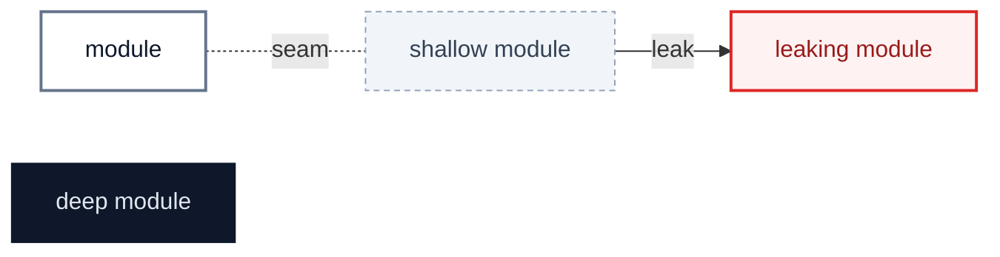
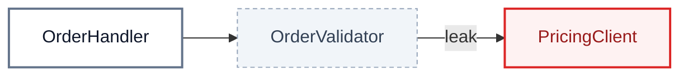

<!--
  arch-review report scaffold. Copy to docs/arch-review/YYYY-MM-DD-<slug>.md and fill it in.
  Keep the section order, the badge emoji, and the classDef block: every report looking the same is the point.
  Replace each <placeholder>; repeat the marked blocks per candidate / finding; drop "Since the last review" on a first scan.
  Mermaid: quote every label ("like this") and never write {{ }} in a diagram; double braces are Mermaid's hexagon shape.
  Delete this comment.
-->

# <repo>: <one-line headline>

`<YYYY-MM-DD>` · at `<sha>` (`<branch>`) · scope: <direction, or the churn hot spots and how they were found> · glossary: `<GLOSSARY.md | none>` · ADRs read: <list>

**Jump to:** [Status](#status) · [Where it hurts](#where-it-hurts) · [C1](#c1--title) · [Smaller findings](#smaller-findings) · [Recommendation](#recommendation)

Legend

## Status

The backlog, in rank order. After the scan only three parts of this file change: this table, each candidate's **Decisions**, and **Departures**. The findings stay as found.

| ID | Deepening | Strength | Lens | Status | Branch | PR | Breaking | Notes |
|---|---|---|---|---|---|---|---|---|
| [C1](#c1--title) | <names the deepening> | 🟢 Strong · 🔴 live defect | deepening | todo | `refactor/<slug>` | | | |
| [S1](#s1--title) | <smaller finding> | — | maintainability | todo | rides with C1 | | | |

Strength: 🟢 Strong · 🟡 Worth exploring · ⚪ Speculative · 🔴 live defect (a bug reproduced during the scan).
Status: `todo` · `in-progress` · `pr-open` · `merged` · `blocked` · `dropped`. `blocked` and `dropped` always carry a reason in Notes.

## Where it hurts

<one line: what the marked modules have in common, e.g. "touched in 31 of the last 40 commits">

## Since the last review

- `<YYYY-MM-DD> C3` — <merged in #41 | still open | dropped because …>

---

<!-- repeat per candidate -->

## C1 · <title>

🟢 **Strong** · 🔴 **live defect** · `<in-process | local-substitutable | ports & adapters | mock>` · builds on: <— | C2>

`<path/a.py:81-127>` · `<path/b.py:117>` · `<tests/test_a.py:34>`

```mermaid
flowchart LR
  subgraph before["Before"]
    direction TB
    A1["OrderHandler"]:::module --> B1["OrderValidator"]:::shallow
    B1 --> C1n["OrderRepo"]:::leak
    C1n -- "leak" --> D1["PricingClient"]:::leak
  end
  subgraph after["After"]
    direction TB
    A2["OrderHandler"]:::module --> I2["Order intake · intake(order)"]:::deep
    subgraph deepmod[" "]
      direction TB
      V2["validation"]:::faded
      P2["pricing"]:::faded
    end
    I2 -.- deepmod
  end
  before ~~~ after
  classDef module fill:#ffffff,stroke:#64748b,stroke-width:2px,color:#0f172a
  classDef shallow fill:#f1f5f9,stroke:#94a3b8,stroke-dasharray:4 3,color:#334155
  classDef deep fill:#0f172a,stroke:#0f172a,color:#e2e8f0
  classDef faded fill:#1e293b,stroke:#475569,color:#94a3b8
  classDef leak fill:#fef2f2,stroke:#dc2626,stroke-width:2px,color:#991b1b
  style deepmod fill:#0f172a,stroke:#0f172a
  style before fill:#fafaf9,stroke:#e2e8f0
  style after fill:#fafaf9,stroke:#e2e8f0
```

> [!CAUTION]
> **Live defect:** <input> → <wrong output>, no error. <!-- only for a live defect; otherwise one plain line with the count that shows the friction -->

| Problem | Solution | Wins |
|---|---|---|
| <one sentence: what hurts> | <one sentence: what changes; no interface design> | locality: <…> leverage: <…> |

> [!NOTE]
> ADR <0007>: <one line on how it bears> <!-- only when an ADR bears on it -->

Decisions

<!-- filled during implementation, one line each -->
Q1 — <question> → <answer>, because <fact>.

---

## Smaller findings

### S1 · <title>

`<path:line>` · rides with <C1 | own PR>

<what, and the fix, in two sentences>

## Recommendation

> [!IMPORTANT]
> **Start with [C1 · <title>](#c1--title)** — <one sentence on why this one first>.
>
> **Proposed batch** (every 🟢 Strong, in order): C1 → C3 → C2

## Departures

<!-- filled during implementation: where a PR deliberately differs from this report, and why -->
